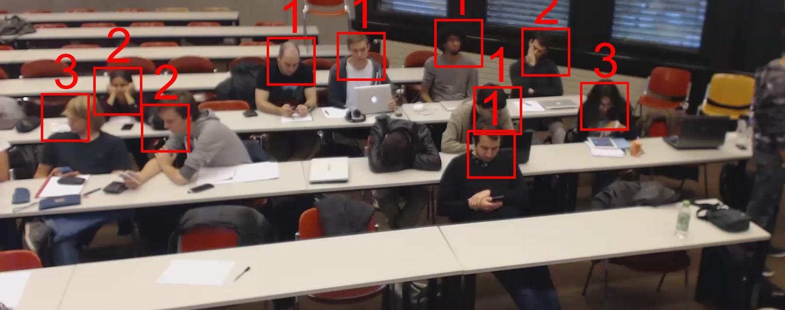

# Predicting Classroom Attention from Images

## Bachelor Project from Marc Bickel
### Fall 2018 at EPFL

This project uses videos labelled by hand as data for a Deep Neural Network constructed using PyTorch. The goal is to be able to predict student attention levels in a classroom, on the only basis of their position. These positions are extracted using the OpenPose library, normalised and precomputed, and fed to fully connected Network. The scale used to represent the attention levels is a linear scale from 1 to 10, and the Network achieves a mean Error to the ground truth of 0.706 and an Accuracy of 57.6%. The final output is a visual representation of the student attention levels.

Example of final output:

## Report
The procedure and results are explained in Report_Bachelor_Project_Marc_Bickel.pdf.

## Reproducibility
To reproduce the final results from the project, open run.ipynb, and run all cells. Note that this uses keypoints_pierre03_augmented.py, the keypoints extracted by OpenPose in the openpose\build\examples\tutorial_api_python\import and save data.ipynb. It also retrains the Neural Network, hence it will take some time.

Also, if you want to extract the keypoints again, you will need to reinstall OpenPose in this directory, and copy the import_and_save_data.ipynb in the folder mentionned above. Otherwise, the paths will not work. 
